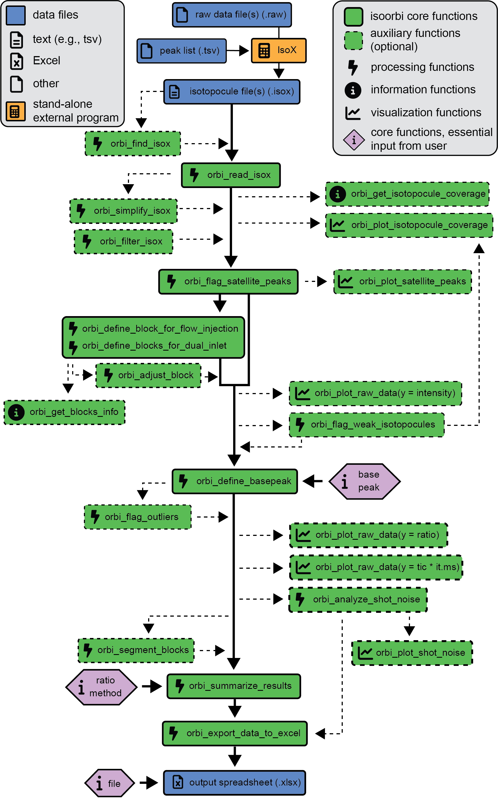

<!-- README.md is generated from README.Rmd. Please edit that file -->

```{r, include = FALSE}
knitr::opts_chunk$set(
  collapse = TRUE,
  comment = "#>",
  fig.path = "man/figures/README-",
  out.width = "100%",
  dpi = 300,
  message = FALSE
)
```

# isoorbi <a href='https://isoorbi.isoverse.org/'>  </a>

<!-- badges: start -->
  [](https://CRAN.R-project.org/package=isoorbi)
  [](https://isoorbi.isoverse.org/)
  [](https://github.com/isoverse/isoorbi/actions)
  [](https://app.codecov.io/gh/isoverse/isoorbi)
<!-- badges: end -->

## Overview

The goal of the isoorbi R package is to help you process isotopocule measurements from an **Orbitrap Isotope Solutions** mass spectrometer. It expects <code>.isox</code> files created by IsoX as input.

## Installation

You can install the current CRAN version of `isoorbi` with:

```{r, eval = FALSE}
install.packages("isoorbi")
```

To use the latest updates, you can install the development version of `isoorbi` from [GitHub](https://github.com/) with:

```{r, eval = FALSE}
if(!requireNamespace("devtools", quietly = TRUE)) install.packages("devtools")
devtools::install_github("isoverse/isoorbi")
```

## Show me some code

```{r "example"}
library(isoorbi)

system.file(package = "isoorbi", "extdata", "testfile_flow.isox") |>
  orbi_read_isox() |>
  orbi_flag_satellite_peaks() |>
  orbi_define_basepeak(basepeak_def = "M0")|> 
  orbi_summarize_results(ratio_method = "sum") |>
  orbi_export_data_to_excel(file = "data_summary.xlsx")
```

```{r, include = FALSE}
unlink("data_summary.xlsx")
```


## Package layout

{width=60%}

## Getting help

If you encounter a bug, please file an issue with a minimal reproducible example on [GitHub](https://github.com/isoverse/isoorbi/issues). 

For questions and other discussion, please use the [isoorbi slack workspace](https://isoorbi.slack.com).
