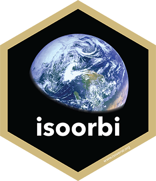
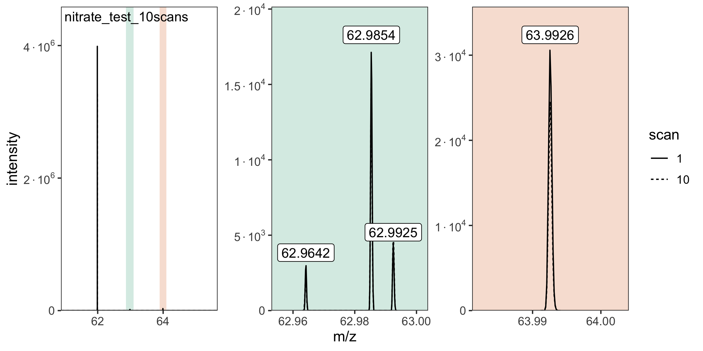
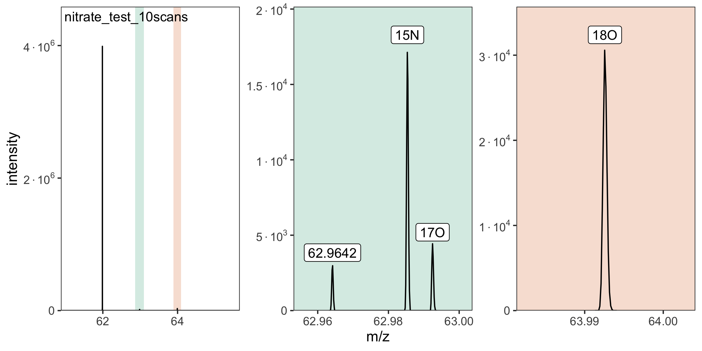
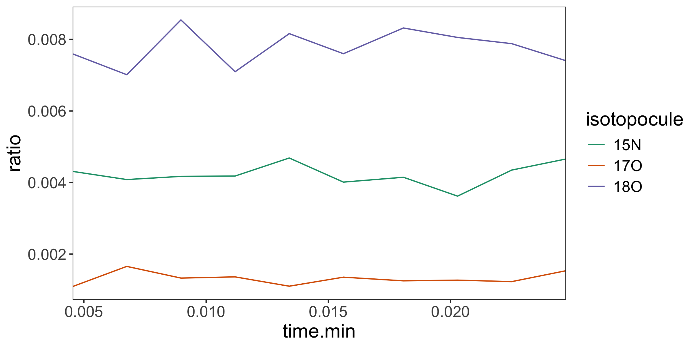
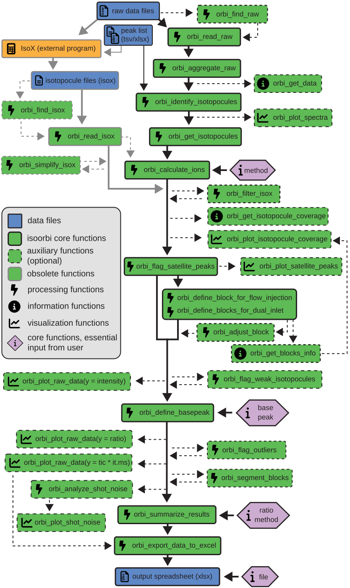

<!-- README.md is generated from README.Rmd. Please edit that file -->

# isoorbi <a href='https://isoorbi.isoverse.org/'>  </a>

<!-- badges: start -->

[](https://CRAN.R-project.org/package=isoorbi)
[](https://isoorbi.isoverse.org/)
[](https://github.com/isoverse/isoorbi/actions)
[](https://app.codecov.io/gh/isoverse/isoorbi)
<!-- badges: end -->

## Overview

The goal of the isoorbi R package is to help you process isotopocule
measurements from an **Orbitrap Isotope Solutions** mass spectrometer.
It can read both the <code>.raw</code> files (recommended approach) as
well as <code>.isox</code> output created by IsoX (legacy approach).

## Installation

You can install the current CRAN version of `isoorbi` with:

``` r
# install the isoorbi package
install.packages("isoorbi")
# check/install the isoraw reader
isoorbi::orbi_check_isoraw()
```

> Important: the call to `orbi_check_isoraw()` installs the [isoraw
> reader](https://github.com/isoverse/isoorbi/tree/main/inst/assembly)
> built into this package, which uses Thermo’s
> [RawFileReader](https://github.com/thermofisherlsms/RawFileReader) to
> make it possible to read .RAW files directly. During the installation,
> you will be asked to agree to [Thermo’s license
> agreement](https://github.com/fgcz/rawrr/blob/devel/inst/rawrrassembly/RawFileReaderLicense.txt)
> to proceed.

### Development version

To use the latest updates, you can install the development version of
`isoorbi` from [GitHub](https://github.com/). If you are on Windows,
make sure to install the equivalent version of
[Rtools](https://cran.r-project.org/bin/windows/Rtools/) for your
version of R (you can find out which version you have with
`getRversion()` from an R console - note that isoorbi requires [R
version](https://cran.r-project.org/) 4.4 or newer).

``` r
# checks that you are set up to build R packages from source
if (!requireNamespace("pkgbuild", quietly = TRUE)) {
  install.packages("pkgbuild")
}
pkgbuild::check_build_tools()

# installs the latest isoorbi package from GitHub
if (!requireNamespace("pak", quietly = TRUE)) {
  install.packages("pak")
}
pak::pak("isoverse/isoorbi")

# check/install the isoraw reader
isoorbi::orbi_check_isoraw()
```

## Show me some code

### Read raw data file

``` r
# load library
library(isoorbi)

# provide the path to your data folder here:
my_data_folder <- file.path("project", "data")

# and search for raw files in that folder
file_paths <- orbi_find_raw(my_data_folder)

# for this example, we use a small raw test file bundled with the
# package instead (remove this line if working with your own data)
file_paths <- orbi_get_example_files("nitrate_test_10scans.raw")

# read the raw file incluing 2 of the raw spectra
raw_files <- file_paths |>
  orbi_read_raw(include_spectra = c(1, 10))

# aggregate the raw data (processes the read files)
raw_agg <- raw_files |> orbi_aggregate_raw()

# plot the spectra
raw_agg |> orbi_plot_spectra()
```



### Identify isotopcules

``` r
# identify isotopcules
# these could also come from a data frame or a tsv/csv/excel file
raw_agg <- raw_agg |>
  orbi_identify_isotopocules(
    isotopocules = c(
      "M0" = 61.9878,
      "15N" = 62.9850,
      "17O" = 62.9922,
      "18O" = 63.9922
    )
  )

# plot again, now with the isotopocules identified
raw_agg |> orbi_plot_spectra()
```



### Process data

``` r
# process raw files data
dataset <- raw_agg |>
  # check for satellite peaks
  orbi_flag_satellite_peaks() |>
  # filter out unidentified isotopocules
  # (happes automatically during define_basepeak as of version 1.5.3)
  orbi_filter_isotopocules() |>
  # define base peak
  orbi_define_basepeak(basepeak_def = "M0")

# plot the resulting isotopocule ratios
dataset |> orbi_plot_raw_data(y = ratio)
```



### Summarize results

``` r
# calculate ratios across scans
results <- dataset |> orbi_summarize_results(ratio_method = "sum")

# print results
results |> orbi_get_data(summary = c("isotopocule", "ratio", "ratio_sem"))

# export results to excel
results |>
  orbi_export_data_to_excel(
    file = "data_summary.xlsx",
    # note: as of version 1.5.3, this is the default and does not need to
    # be specified explicitly anymore
    include = c("file_info", "summary")
  )
```

| uidx | filename             | isotopocule |     ratio | ratio_sem |
|-----:|:---------------------|:------------|----------:|----------:|
|    1 | nitrate_test_10scans | 15N         | 0.0042241 | 0.0000980 |
|    1 | nitrate_test_10scans | 17O         | 0.0013175 | 0.0000554 |
|    1 | nitrate_test_10scans | 18O         | 0.0077492 | 0.0001622 |

For additional code, please check out our **Examples** in the main menu
at [isoorbi.isoverse.org](https://isoorbi.isoverse.org/), and peruse the
full package structure below.

## Package structure

[](https://isoorbi.isoverse.org/#package-structure)

## Getting help

If you encounter a bug, please file an issue with a minimal reproducible
example on [GitHub](https://github.com/isoverse/isoorbi/issues).

For questions and other discussion, please use the [isoorbi slack
workspace](https://isoorbi.slack.com).

## isoverse <a href='http://www.isoverse.org'></a>

This package is part of the isoverse suite of data tools for stable
isotopes. If you like the functionality that isoverse packages provide
to the geochemical community, please help us spread the word and include
an isoverse or individual package logo on one of your posters or slides.
All logos are posted in high resolution in [this
repository](https://github.com/isoverse/logos). If you have suggestions
for new features or other constructive feedback, please let us know on
this short [feeback form](https://www.isoverse.org/feedback/).
