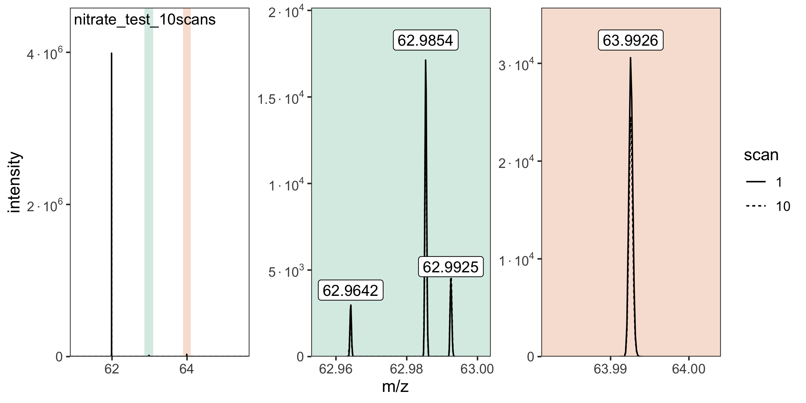
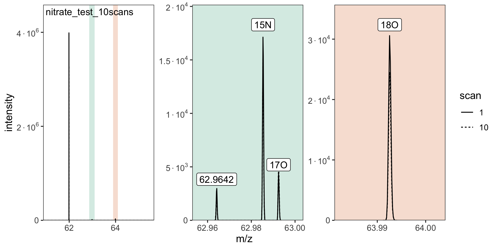

<!-- README.md is generated from README.Rmd. Please edit that file -->

# isoorbi 

<!-- badges: start -->

<!-- badges: end -->

## Overview

The goal of the isoorbi R package is to help you process isotopocule
measurements from an **Orbitrap Isotope Solutions** mass spectrometer.
It can read both the <code>.raw</code> files (recommended approach) as
well as <code>.isox</code> output created by IsoX (legacy approach).

## Installation

You can install the current CRAN version of `isoorbi` with:

    install.packages("isoorbi")

To use the latest updates, you can install the development version of
`isoorbi` from [GitHub](https://github.com/) with:

    if(!requireNamespace("devtools", quietly = TRUE)) install.packages("devtools")
    devtools::install_github("isoverse/isoorbi")

> Important: as of isoorbi version 1.5.0, it is possible to read .raw
> files directly using the [isoraw
> reader](https://github.com/isoverse/isoorbi/tree/main/inst/assembly)
> built into this package. The first time you read a .raw file, you will
> be asked to agree to [Thermo’s license
> agreement](https://github.com/fgcz/rawrr/blob/devel/inst/rawrrassembly/RawFileReaderLicense.txt)
> to proceed. Implementation of the isoraw reader, would not have been
> possible without the example provided by Jim Shofstahl as part of
> Thermo’s
> [RawFileReader](https://github.com/thermofisherlsms/RawFileReader) and
> the raw file reader developed by Witold Wolski, Christian Panse,
> Christian Trachsel, and Tobias Kockmann as part of the [rawrr
> package](https://github.com/fgcz/rawrr).

## Show me some code

### Read raw data file

    # load library
    library(isoorbi)

    # provide the path to your data folder here:
    my_data_folder <- file.path("project", "data")

    # and search for raw files in that folder
    file_paths <- orbi_find_raw(my_data_folder)

    # for this example, we use a small raw test file bundled with the
    # package instead (remove this line if working with your own data)
    file_paths <- orbi_get_example_files("nitrate_test_10scans.raw")

    # read the raw file incluing 2 of the raw spectra
    raw_files <- file_paths |>
        orbi_read_raw(include_spectra = c(1, 10)) |>
        orbi_aggregate_raw()

    # plot the spectra
    raw_files |> orbi_plot_spectra()

### Identify isotopcules

    # identify isotopcules
    # these could also come from a data frame or a tsv/csv/excel file
    raw_files <- raw_files |> orbi_identify_isotopocules(
      isotopocules = 
        c("M0" = 61.9878, "15N" = 62.9850, "17O" = 62.9922, "18O" = 63.9922)
    )

    # plot again, now with the isotopocules identified
    raw_files |> orbi_plot_spectra()

### Process data

    # process raw files data
    dataset <- raw_files |>
      # filter out unidentified peaks
      orbi_filter_isotopocules() |>
      # check for satellite peaks
      orbi_flag_satellite_peaks() |>
      # define base peak
      orbi_define_basepeak(basepeak_def = "M0")

    # plot the resulting isotopocule ratios
    dataset |> orbi_plot_raw_data(y = ratio)

### Summarize results

    # calculate ratios across scans
    results <- dataset |> orbi_summarize_results(ratio_method = "sum")
       
    # print results
    results |>  orbi_get_data(summary = c("isotopocule", "ratio", "ratio_sem"))

    # export data & results to excel
    results |> orbi_export_data_to_excel(file = "data_summary.xlsx")

    # A tibble: 3 × 5
       uidx filename             isotopocule   ratio ratio_sem
      <int> <chr>                <fct>         <dbl>     <dbl>
    1     1 nitrate_test_10scans 15N         0.00422 0.0000980
    2     1 nitrate_test_10scans 17O         0.00132 0.0000554
    3     1 nitrate_test_10scans 18O         0.00775 0.000162 

For additional code, please check out our **Examples** in the main menu
at [isoorbi.isoverse.org](https://isoorbi.isoverse.org/), and peruse the
full package structure below.

## Package structure

## Getting help

If you encounter a bug, please file an issue with a minimal reproducible
example on [GitHub](https://github.com/isoverse/isoorbi/issues).

For questions and other discussion, please use the [isoorbi slack
workspace](https://isoorbi.slack.com).
