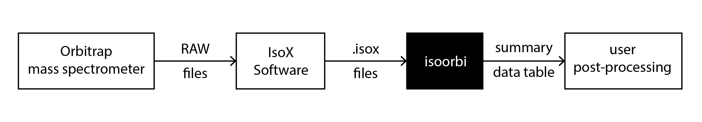

# Summary

The measurement of naturally occurring stable isotope patterns is widely used in environmental science, geology, archeology, forensics, biomedical research, and many other fields. Recent studies show that electrospray ionization Orbitrap mass spectrometers can be adapted for isotope ratio analysis of metabolites, drugs, oxyanions, and other intact polar solutes.[@eiler2017analysis; @neubauer2018scanning; @neubauer2020stable; @hilkert2021exploring; @mueller2021simultaneous; @zeichner2022methods] Similar high-precision measurements were possible before only on gas-source isotope ratio mass spectrometers (IRMS). However, in earlier methods,foundation much of the intramolecular isotopic information in polar compounds is erased during the conversion of analytes to gases.

The new technique creates a need for specific data extraction, reduction, and analysis software. The `isoorbi` R package provides core functionality for rigorous data reduction. It thereby provides a critical link between initial mass spectrometry data extraction and custom post-processing/interpretation of isotope ratios by the user (\autoref{fig:workflow}).  The `isoorbi` package reads Thermo `.isox` files generated by the `IsoX` software (Thermo Scientific), which extracts relevant isotopic data from Orbitrap `RAW` files and reports them as tab-separated values (`TSV`). For data reduction, `isoorbi` offers custom filters to remove outliers and subsets of the data, as well as functions to calculate isotope ratios and aggregate the results in a summary table. Based on the package, custom user interfaces can be generated for different experimental workflows (demo example: [isoorbi.shinyapps.io/IsoXL](https://isoorbi.shinyapps.io/IsoXL)). `Isoorbi` thereby provides a foundational tool for platform-independent and efficient data reduction in an emerging area of IRMS.

# Statement of need

Data tools like the `isoorbi` package are crucial for efficient and reproducible data processing for researchers working with isotope ratio instruments. The `isoorbi` package expands the already existing open-source [isoverse.org](https://www.isoverse.org/) platform that was focused on the traditional IRMS instruments. [@kopf2021isoreader] Recently, the Orbitrap approach has been introduced as a new method for isotope ratio analysis and the number of laboratories using it is on the rise. However, up till now, there was no common tool set for reproducible processing and analysis of Orbitrap data. 

The `isoorbi` package offers a core functionality for data extraction from the `.isox` files and data reduction from thousands of rows to a simple data table containing calculated isotope ratios and summary statistics. The `isoorbi` package thereby significantly lowers the barrier for new users to get started with this technology. It further supports the development of a new research community by enabling reproducible data reduction across laboratories, without the need for proprietary software. The package can be used on operating software (Windows, Mac, Linux) that support the R software environment. The summary data can be further processed for precision isotope analysis (e.g., custom $\delta$ scale correction) using widely available data science tools based on user preference (e.g., R, Python, Excel). There are numerous research groups that already employ the package for analysis of Orbitrap data in ongoing projects.

# Acknowledgements

This work was supported by National Science Foundation award #2041539 and a Postdoc.Mobility fellowship (to K. K.) by the Swiss National Science Foundation (project number P500PN_206702). The authors thank Leif Anders for assistance in the coding project.

# References

here will be references
